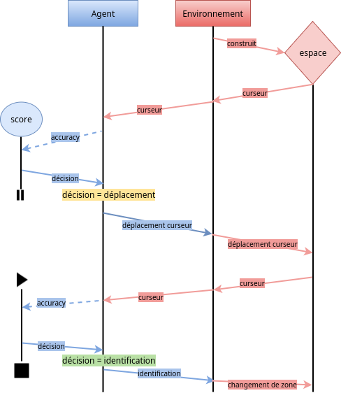

# Introduction {-}

Ce projet s'inscrit dans le cadre du cours 3I013 : "Introduction à la recherche". Cette unité d'enseignement a pour but de nous faire découvrir le travail de recherche à travers un projet en lien avec les travaux des laboratoires de l'UPMC.  Il s'étend sur tout le second semestre de la L3. Notre sujet est : "Environnement logiciel pour l'apprentissage de l'exploration visuelle d'une image". Il est encadré par Olivier Sigaud, professeur et chercheur à l'Université Pierre et Marie Curie en informatique.

Il existe de nombreux procédés permettant d'identifier des objets dans un espace. Ce projet ajoute une contrainte : on ne peut jamais voir en entier ce que l'on observe. Le but est de concevoir un environnement et un agent qui sont capables d'explorer un espace afin d'identifier ce qu'il contient. Dans ce projet, les objets à identifier sont des chiffres manuscrits provenant du jeu de données MNIST. L'espace d'exploration est défini par un ensemble de chiffres disposés en grille.

Ce projet s'est organisé en trois grandes parties : l'environnement, l'agent et la recherche expérimentale des paramètres optimaux. Cette dernière section a pour objectif de comprendre l'influence de certains paramètres sur l'efficacité de l'agent, afin de trouver un réglage aboutissant à des résultats satisfaisants.

L'objectif premier de ce projet est de programmer un environnement dans lequel un agent a pour objectif d'identifier le chiffre qu'il observe. Il doit contenir un certain nombre de fonctionnalités et suivre une API particulière. Cette première étape est essentielle car, bien réalisée, elle permet d'explorer différentes méthodes de résolution de notre problème en garantissant une constance dans l'évaluation des différentes solutions.
Bien que primordiale, elle a dû être réalisée rapidement car l'intérêt de ce projet réside dans la seconde partie qui est la recherche et le développement de l'agent.

L'axe de recherche étant centré sur l'intelligence artificielle, il nous est imposé d'explorer des solutions faisant appel à des réseaux de neurones. Cette étape se divise en trois parties : la prédiction, la prise de décisions et l'exploration de l'image. En accord avec notre encadrant, nous nous sommes concentrés sur les deux premières étapes.

\newpage

## Interaction agent-environnement {-}

L'environnement et l'agent doivent échanger de l'information et suivent un algorithme assez simple, illustré sur la figure @fig:agent_env_loop :

(1) L'environnement construit la grille de chiffres à partir du jeu de données MNIST. On appelle **imagette** une case de la grille ainsi construite, et **espace** l'image que constitue la grille.
(2) L'environnement récupère une petite zone rectangulaire de l'espace à une position donnée : on appelle cette zone **curseur**. Le curseur correspond à la zone de vision de l'agent.
(3) L'agent récupère le curseur fourni par l'environnement.
(4) L'agent analyse ce qu'il voit, puis transmet à l'environnement le déplacement suivant du curseur ainsi qu'une identification du chiffre s'il décide d'en faire une.
(5) Deux cas possibles :
    (a) Si l'identification est correcte, alors l'environnement change de zone;
    (b) Sinon, l'environnement déplace le curseur dans la direction indiquée par l'agent.

On recommence à l'étape (2).

{#fig:agent_env_loop width=90%}

Un déplacement du curseur est un glissement de ce dernier dans son voisinage, alors qu'un changement de zone est un positionnement aléatoire du curseur dans l'espace. Le déplacement du curseur permet l'exploration de l'imagette sur laquelle se trouve l'agent, afin d'aboutir à une identification.

# Environnement {-}
\stepcounter{chapter}

L'environnement a pour fonction première de positionner et fournir les données du curseur à l'agent. Il doit être suffisamment générique pour qu'il soit relativement simple de changer d'agent.

Le second rôle de l'environnement est de gérer la récompense de l'agent dans le cadre d'un **apprentissage par renforcement**. En effet, au-delà de fournir les données visuelles du curseur, on veut pouvoir **punir** ou **récompenser** l'agent selon la justesse et/ou la vitesse de l'identification, afin qu'il puisse optimiser son choix de déplacement. Même si nous n'avons pas été chargés de cette partie pour l'agent, l'environnement doit être conçu pour supporter ce cadre d'apprentissage par renforcement, ce que nous ferons en utilisant l'API fournie par la bibliothèque OpenAI Gym.

## Cahier des charges 

L'environnement doit comporter plusieurs fonctions : 

1. Une fonction pour construire la grille de chiffres à partir du jeu de données MNIST.
2. Une fonction qui renvoie le curseur.
3. Une fonction qui renvoie le chiffre associé à l'imagette sur laquelle travaille l'agent (déterminée selon la position du curseur), afin de savoir s'il doit être puni ou récompensé lorsqu'il propose une identification.
4. Une fonction de récompense, qui retourne un score positif ou négatif selon que l'on souhaite respectivement récompenser ou punir l'agent.
5. Une méthode `step`, qui correspond à une itération de la boucle d'interaction agent-environnement.

L'environnement est soumis à plusieurs contraintes :

- Il doit être codé en Python.
- Il doit être compatible avec l'API imposée par OpenAI Gym.

\newpage

## Apprentissage par renforcement

L'*apprentissage par renforcement* désigne une classe d'algorithmes d'apprentissage utilisés en intelligence artificielle et inspirés de la psychologie animale, dont le principe est de permettre à un agent d'améliorer son adaptation à un environnement par essais-erreurs successifs.

L'apprentissage par renforcement se formalise dans le cadre des processus décisionnels de Markov (\textsc{mdp}). Un \textsc{mdp} définit :

1. un ensemble d'états $S$ de l'agent dans l'environnement;
2. un ensemble d'actions $A$ que l'agent peut effectuer;
3. un ensemble de valeurs scalaires "récompenses" $R$ que l'agent peut obtenir;
4. une fonction de probabilité de transition entre états $p$. 

À chaque pas de temps $t$ de l'algorithme, l'agent perçoit son état $s_{t}\in S$ et l'ensemble des actions possibles $A(s_{t})$. Il choisit une action $A(s_{t})$ et reçoit de l'environnement un nouvel état $s_{t+1}$ et une récompense $r_{t+1}$. Fondé sur ces interactions, l'algorithme d'apprentissage par renforcement doit permettre à l'agent de développer une politique $\Pi :S\rightarrow A$ qui lui permette de maximiser la quantité de récompenses.

On remarque rapidement les correspondances avec les éléments du cahier des charges fourni par notre encadrant. On peut ainsi définir les différentes composantes de notre modèle :

0. On se place dans un espace de largeur $W$ et de hauteur $H$, avec un curseur de largeur $w$ et de hauteur $h$.
1. $S$ est l'ensemble des curseurs possibles, c'est-à-dire l'ensemble des images aux dimensions du curseur. On a donc $S = G^{h \times w}$, avec $G = \{0,1,\ldots,255\}$ les différents niveaux de gris d'un pixel.
2. $A$ est le produit $P \times D$ de l'ensemble des déplacements $P$ que peut effectuer l'agent par l'ensemble des chiffres $D$ pouvant être identifiés. Pour les déplacements, on envisage deux approches :

    a. On laisse la liberté à l'agent de se "téléporter" n'importe où dans l'espace. Dans ce cas, notre espace de déplacements est l'ensemble des positions possibles du curseur dans l'espace. Sachant que le curseur ne doit pas sortir de l'espace, cela réduit l'espace des positions à $P = P_x \times P_y$, avec $P_x = \{0,1,\ldots,W - w\}$ et $P_y = \{0,1,\ldots,H - h\}$ les positions possibles sur les axes respectivement horizontal et vertical.
    b. Le comportement envisagé initialement étant plutôt de faire glisser le curseur dans son voisinage, on peut restreindre notre espace de déplacements aux 4 directions orthogonales. On peut par exemple encoder ces directions sur $P = \{0,1,2,3\}$, valeurs que devra décoder l'environnement pour effectuer le déplacement adéquat.

    Pour les chiffres identifiables, on rajoute aux chiffres usuels le nombre $10$, qu'on interprétera comme l'absence de tentative d'identification : $D = \{0,1,\ldots,10\}$.
3. $R$ est l'ensemble des scores que l'on va attribuer à l'agent selon la justesse de ses identifications. On distingue 3 cas de figure correspondant à 3 fonctions de score :  

    - $e:X\to \mathbb{R^*_-}$ quand l'identification est incorrecte
    - $a:X\to \mathbb{R}$ quand l'agent s'abstient de faire une identification
    - $s:X\to \mathbb{R^*_+}$ quand l'identification est correcte  

    $X$ est un ensemble de paramètres de notre choix, par exemple le score de l'agent à l'itération précédente. On peut donc concevoir différents systèmes de score selon le comportement que l'on souhaite encourager chez l'agent :
    a. Si l'objectif est que l'agent prenne rapidement des décisions et tente un grand nombre d'identifications, on choisira des petites valeurs de $e$, et on s'assurera d'avoir $a(x) < 0$.
    b. Dans notre cas, on cherche plutôt à ce que l'agent soit le plus certain possible avant de tenter une identification, afin de maximiser sa précision. On préfèrera alors avoir de petites valeurs négatives pour $e$, une valeur nulle pour $a$, et de grandes valeurs positives pour $s$. Pour simplifier, on prendra $e = -3$, $a = 0$, $s = 30$.

## Implémentation

### Chargement de la grille de chiffres

#### Lecture du jeu de données MNIST

Dans un premier temps, nous nous sommes attelés à mettre en place des fonctions utilitaires permettant de charger le jeu de données MNIST dans un format facile à manipuler pour l'environnement.

Nous utilisons la version officielle du jeu de données disponible sur la page personnelle du pionnier du *deep learning* Yann LeCun. On y trouve notamment que le jeu est divisé en un ensemble dédié à l'apprentissage contenant 60000 images de chiffres manuscrits, et un ensemble de test contenant 10000 images. Les images, qui correspondent à ce qu'on appelle les imagettes, sont de taille $28 \times 28$, avec le chiffre en lui-même tenant dans un rectangle de taille $20 \times 20$ centré dans l'imagette ; ce qui explique l'espace vide entre les chiffres, observable sur la capture d'écran en figure @fig:numgrid.

{#fig:numgrid width=30%}

De plus, chacun des ensembles est réparti sur 2 fichiers : l'un contenant les données visuelles à proprement parler, et l'autre contenant les *labels*, c'est-à-dire les chiffres associés aux images que l'agent doit identifier. On a donc 4 fichiers, tous archivés au format `gzip` et encodés dans un format particulier conçu pour les vecteurs et les tableaux multidimensionnels numériques : le format `idx`.

Yann LeCun explique sur sa page comment les données sont encodées dans ce format : la première partie du fichier, le *header*, est dédiée aux métadonnées que sont le **type** des données enregistrées (par exemple `int` ou `float`), ainsi que leurs **dimensions**, c'est-à-dire un $n$-uplet $(d_1,\ldots,d_n)$ où $d_i$ est le nombre de valeurs du tableau sur la $i^{\text{ème}}$ dimension. On a implémenté la fonction `gym_numgrid.utils.get_idx_metadata` qui lit et retourne lesdites métadonnées.

Viennent ensuite les données à proprement parler, que l'on va pouvoir lire --- en utilisant les métadonnées récupérées précédemment --- avec la fonction `gym_numgrid.utils.load_idx_data`. Que ce soit dans la lecture des métadonnées ou des données, nous avons essayé d'être le plus générique possible en faisant abstraction des informations spécifiques au jeu de données MNIST. En particulier, la méthode `load_idx_data` prend deux paramètres :

`outer_shape` :

:   dimensions "extérieures" que l'on souhaite ajouter aux dimensions lues dans les métadonnées. Typiquement, pour obtenir une grille contenant 10 imagettes en largeur et 5 en hauteur, on aura $\text{\texttt{outer\_shape}} = (10,5)$.

`pos` :

:   liste des indices des données qu'on veut récupérer. On aura par exemple $\text{\texttt{pos}} = [0,2,5]$ pour récupérer dans l'ordre la $1^{\text{ère}}$, la $3^{\text{ème}}$ et la $6^{\text{ème}}$ imagette. Ce paramètre nous sera particulièrement utile pour charger spécifiquement un ensemble de chiffres, par exemple avoir une grille constituée uniquement de 0 et de 3.

Selon que ces 2 paramètres soient spécifiés ou non, on charge un des 4 ensembles d'exemples\footnote{On appelle \textit{exemple} un élément du jeu de données, par exemple une imagette ou un chiffre.} listés dans la table \ref{tbl:load_idx_data_usecases}.

\begin{table}[h]
    \centering
        \begin{tabularx}{0.872\textwidth}{|O{0.15}|M{0.3}|M{0.3}|}\hline
        \diaghead{pos \quad outer\_shape}{\texttt{pos}}{\texttt{outer\_shape}} & \thead{Non-spécifié} & \thead{Spécifié} \\ \hline
        \thead{Non-spécifié }
        & Totalité du jeu de données sur une seule dimension.
        & $n$ premiers exemples, avec $n$ le produit des dimensions spécifiées dans \texttt{outer\_shape}. \\ \hline
        \thead{Spécifié}
        & Exemples aux indices spécifiés par \texttt{pos} sur une seule dimension.
        & Exemples aux indices spécifiés par \texttt{pos} avec les dimensions spécifiées par \texttt{outer\_shape}. \\ \hline
    \end{tabularx}
    \caption{Cas d'utilisation de la fonction \texttt{load\_idx\_data}}
    \label{tbl:load_idx_data_usecases}
\end{table}

#### Construction de la grille

Avec ces fonctions utilitaires, la construction de la grille est simple à mettre en oeuvre. On l'implémente dans la classe `NumGrid`, dont le fonctionnement est détaillé un peu plus loin.

Notre première approche a été d'utiliser simplement `load_idx_data` avec pour paramètre $\text{\texttt{outer\_shape}} = (\text{\textit{hauteur}},\text{\textit{largeur}})$. Néanmoins, nous avons constaté que le chargement d'une grande grille, par exemple de taille $100 \times 100$, prend plusieurs dizaines de secondes, ce qui devient assez problématique lorsqu'il faut effectuer régulièrement des tests lors du développement de l'agent.

Le problème vient de l'algorithme utilisé pour charger uniquement un sous-ensemble de chiffres, implémenté en Python de la manière suivante :

``` {#loadgrid .python .numberLines}
# (1)
self.labels = mnist_loader.load_idx_data(mnist_labels_path)

# (2)
num_examples = np.prod(size)
i = 0
labels_i = []
while len(labels_i) < num_examples:
    if self.labels[i] in digits:
        labels_i.append(i)
    i += 1

# (3)
self.images = mnist_loader.load_idx_data(mnist_images_path, (labels_i[-1] + 1,))

# (4)
self.labels = self.labels[labels_i].reshape(size[::-1] + self.labels.shape[1:])
self.images = self.images[labels_i].reshape(size[::-1] + self.images.shape[1:])
```

Détaillons les différentes étapes de l'algorithme :

(1) Chargement de l'ensemble des labels depuis le disque
(2) Parcours des labels pour stocker les indices correspondant aux chiffres que l'on souhaite charger
(3) Chargement des $n+1$ premières images depuis le disque, avec $n$ le dernier indice calculé
(4) Sélection des labels et des images aux indices calculés

Le problème se situe à l'étape (3), où l'on charge plus d'images que nécessaire ; or une image est bien plus lourde en mémoire qu'un label. L'approche est toujours meilleure que de charger la totalité des images et peut suffire pour des grilles de taille moyenne, mais pas pour de grandes tailles, nécessaires pour permettre l'entraînement de l'agent sur des exemples suffisemment variés.

C'est pour pallier ce problème que nous avons rajouté l'option `pos` (et la mécanique interne qui va avec) à la fonction `load_idx_data`, qui nous permet alors de charger directement les images aux indices calculés à l'étape (2).

### OpenAI Gym 

OpenAI Gym est à la fois une bibliothèque Python offrant un ensemble d’outils facilitant le développement d’environnements pour l’apprentissage par renforcement, et une plateforme communautaire permettant de les partager afin de tester, comparer et améliorer les algorithmes d’apprentissage par renforcement. Elle est développée principalement par la société à but non-lucratif OpenAI, fondée en décembre 2015 par des personnalités célèbres telles que Elon Musk dans le but de promouvoir un développement open-source de l'intelligence artificielle générale --- en partie pour éviter le *risque existentiel* craint par certains.

Outre ces détails historiques, il est intéressant de remarquer que la bibliothèque est encore en version *bêta*, la première version ayant été publiée sur GitHub en avril 2016. Cela nous a mené à quelques reprises à refactoriser certaines parties de notre code, pour pallier les rétro-incompatibilités amenées dans l'API par les nouvelles versions.

### Classe `NumGrid`

Dans un second temps, l'objectif a donc été d'implémenter l'environnement à proprement parler au sein de la classe `gym_numgrid.envs.NumGrid`. Cette classe doit hériter et se conformer à l’API de la classe `gym.Env`.

#### Espaces d'actions et d'états

OpenAI Gym étant une bibliothèque récente, la grande majorité de la documentation est présente sous forme de commentaires dans le code source disponible sur GitHub. C'est le cas notamment pour la classe `Env` ; on y apprend qu'un environnement doit définir obligatoirement les attributs suivants :

`action_space` :
:   instance de la classe `gym.Space` correspondant à l'espace d'actions $A$

`observation_space` :
:   instance de la classe `gym.Space` correspondant à l'espace d'états $S$

Dans la [section 1.2](#apprentissage-par-renforcement), nous avons défini $A = P \times D$, avec $P$ l'espace des déplacements et $D$ l'espace des chiffres. Nous choisissons de prendre par défaut l'espace de déplacements le plus large (i.e. l'ensemble des positions $P_x \times P_y$), qui pourra être changé par la suite à l'aide du mécanisme de *wrapper* proposé par OpenAI Gym.

Il reste qu'il faut choisir comment traduire ces définitions mathématiques en instances de `gym.Space` (ou de ses classes filles). La construction des différents espaces est implémentée dans le constructeur `__init__` de `NumGrid`, où l'on peut établir les correspondances listées dans la table \ref{tbl:spaces}.

\begin{table}[h]
    \centering
    \begin{tabularx}{\textwidth}{|O{0.2}|O{0.2}|O{0.2}|M{0.35}|}\hline
        \thead{Espace} & \thead{Attribut} & \thead{Classe} & \thead{Explication} \\ \hline

        $D = \{0,1,\ldots,10\}$ & \texttt{digit\_space} & \texttt{Discrete} &
        Espace discret de taille $n$ codé sur $\{0,1,\ldots,n\}$.
        Ici on prend $n = 10$, le codage correspondant
        exactement à notre définition mathématique. \\ \hline

        $P = P_x \times P_y$ & \texttt{position\_space} & \texttt{MultiDiscrete} &
        Produit cartésien de plusieurs \texttt{Discrete}.
        Ici on peut bien traduire $P_x$ et $P_y$ comme
        2 \texttt{Discrete} codés respectivement sur
        $\{0,1,\ldots,W-w\}$ et $\{0,1,\ldots,H-h\}$. \\ \hline

        $A = P \times D$ & \texttt{action\_space} & \texttt{Tuple} &
        Produit cartésien de plusieurs \texttt{Space}, ici $P$ et $D$. \\ \hline

        $S = G^{h \times w}$ & \texttt{observation\_space} & \texttt{Box} &
        Espace des réels dans $[\alpha,\beta]^n$.
        On se permet de passer au continu car d'une part le discret
        y est inclus, et d'autre part nous avons constaté que des environnements
        existants avec des espaces d'observation similaires, par exemple
        les jeux Atari, utilisent aussi la classe \texttt{Box}.
        Ici on prend donc $\alpha = 0$, $\beta = 255$, $n = h \times w$. \\ \hline
    \end{tabularx}
    \caption{Implémentation des espaces d'actions et d'états}
    \label{tbl:spaces}
\end{table}

\newpage

#### Méthodes

La documentation de la classe `Env` indique qu'il faut implémenter au moins les 4 méthodes suivantes :

`_step(self, action)` :

:   Effectue un pas de temps de la boucle d'interaction agent-environnement. Concrètement, c'est ici qu'on traite l'action envoyée par l'agent et qu'on lui fournit des informations en retour, ce qui se traduit par les opérations suivantes :

    (1) Vérification que la position que souhaite atteindre l'agent ne sort pas de l'espace
    (2) Déplacement du curseur
    (3) Choix d'une récompense négative, nulle ou positive selon l'identification
    (4) Réinitialisation de la position du curseur si l'identification est correcte
    (5) Vérification de fin d'épisode
    (6) Retour des diverses informations

    L'étape (5) est nécessaire car c'est l'environnement qui gère la longueur d'un *épisode*, c'est-à-dire le nombre de pas de temps à effectuer avant de réinitialiser l'environnement (en plus de la réinitialisation de l'étape (4)). Conformément à l'API, les valeurs retournées à l'étape (6) sont les suivantes :

    - `observation` : le curseur
    - `reward` : la récompense
    - `done` : booléen indiquant si l'épisode est terminé
    - `info` : un dictionnaire contenant des informations supplémentaires, en l'occurrence :
        - `out_of_bounds` : booléen indiquant si l'agent a tenté un déplacement sortant de l'espace
        - `digit` : le chiffre sur lequel est positionné le curseur au pas de temps courant

`_reset` :

:   Réinitialise l'état de l'environnement. Cela revient à démarrer un nouvel épisode en repositionnant aléatoirement le curseur dans l'espace, ce que l'on fait en échantillonnant notre espace de positions --- `self.position_space.sample()` ; on réinitialise aussi le pas de temps. On retourne finalement le curseur à sa nouvelle position.

`_render` :

:   Permet d'afficher l'environnement. Dans notre cas, on affiche une fenêtre où sont dessinées la grille de chiffres ainsi que les limites du curseur, comme nous avons pu le voir précédemment sur la figure @fig:numgrid. L'affichage se met à jour à chaque pas de temps, ce qui revient simplement à redessiner le curseur. L'implémentation se base sur la bibliothèque `gym.envs.classic_control.rendering`, elle-même basée sur la bibliothèque `pyglet`, un port en Python d'OpenGL. Nous avons néanmoins ajouté notre propre classe `gym_numgrid.envs.rendering.Image` permettant de dessiner la grille de chiffres à partir de sa représentation en mémoire vive, car la classe `gym.envs.classic_control.Image` ne permet que le chargement depuis un fichier.

`_close` :

:   Permet d'effectuer toute opération de nettoyage qui serait nécessaire lorsqu'on ne se sert plus de l'environnement. Dans notre cas, on se contente de fermer la fenêtre d'affichage (si on l'utilise).

À cela, nous ajoutons trois méthodes, considérées comme des attributs grâce au décorateur `@property` de Python, permettant d'accéder simplement aux informations courantes de l'environnement :

`cursor` :

:   Le curseur. Pour éviter des traitements mémoire inutiles, on ne stocke dans l'environnement que la position (du coin haut-gauche) du curseur, ainsi que sa taille. Ainsi, plutôt que de mettre à jour à chaque pas de temps le curseur, on se contente de le récupérer dans l'espace à partir de ces 2 propriétés.

`cursor_center` :

:   Position $(c_x,c_y)$ du centre du curseur. En considérant $(p_x,p_y)$ la position du curseur de largeur $w$ et de hauteur $h$, on calcule les coordonnées $c_x = p_x + \left\lfloor\frac{w}{2}\right\rfloor$ et $c_y = p_y + \left\lfloor\frac{h}{2}\right\rfloor$.

`current_digit` :

:   Le chiffre actuellement sous le curseur. Pour le déterminer, on récupère l'index de l'image sur laquelle se trouve le centre du curseur, puis on renvoie le chiffre placé à cet index.

### Espaces et wrappers

Nous avons évoqué dans la [section 1.3.3.1](#espaces-dactions-et-détats) le mécanisme de *wrapper* proposé par OpenAI Gym comme solution pour disposer d'un espace d'actions réduit aux 4 directions. Ce mécanisme est en fait bien plus général, car il permet d'ajouter n'importe quel attribut ou comportement nouveau à un environnement.

Pour ce faire, nous disposonz de la classe `gym.Wrapper`, dont le principe est de reprendre l'ensemble de l'API de la classe `Env`, et de stocker en plus l'instance de l'environnement que l'on souhaite modifier, à laquelle on fait appel dans chaque méthode de l'API. L'usage du wrapper sera ainsi similaire à celui de l'environnement, les comportements supplémentaires étant définis dans les méthodes du wrapper.

En plus de cela, OpenAI Gym propose des sous-classes de `Wrapper` déjà prévues pour la conversion des valeurs entre espaces d'actions et d'observations, respectivement `ActionWrapper` et `ObservationWrapper`. Dans notre cas, nous héritons uniquement de la classe `ActionWrapper`, en implémentant la méthode `_action(self, action)` qui prend en paramètre l'action dans le nouvel espace d'actions, et retourne l'action correspondante dans l'ancienne espace. Nous implémentons de cette façon 4 wrappers :\footnote{Nous précisons entre parenthèses les paramètres du constructeur quand il y en a.}

`NumGridWrapper` :

:   Classe abstraite dont les autres wrappers héritent, permettant de conserver sur plusieurs "couches" de wrappers les espaces non pris en charge par la classe `Wrapper`, à savoir `digit_space` et `position_space`, ainsi que certains attributs de `NumGrid`. Il est donc ici inutile d'hériter de `ActionWrapper`\footnote{Ce qui explique que nous n'ayons pas parlé de 5 wrappers.}.

`DirectionWrapper(distance=1)` :

:   Convertit les directions en positions dans l'espace. Une direction est fournie sous la forme $(-1,0),\ (1,0),\ (0,-1),\ (0,1)$, respectivement pour les directions $\leftarrow,\ \rightarrow,\ \uparrow,\ \downarrow$. Le paramètre `distance` correspond au nombre de pixels parcourus lors d'un seul déplacement.

`DiscreteDirectionWrapper(distance=1)` :

:   Similaire à `DirectionWrapper`, avec un espace de directions discret $\{0,1,2,3\}$.

`DiscretePositionWrapper` :

:   Wrapper avec un espace de positions discret, associant à chaque position de l'espace un entier unique (notamment grâce à la fonction `utils.total_discrete_mapping`).

`DiscreteActionWrapper` :

:   Wrapper avec un espace d'actions discret, associant à chaque couple $(\text{\textit{déplacement}},\text{\textit{direction}})$ un entier unique.

Les 3 dernier wrappers sont particulièrement utiles dans le cas où l'agent utilise un espace d'actions de type `Discrete`. On peut par exemple construire un environnement permettant de spécifier une action discrète (sous forme de nombre entier) et utilisant un déplacement directionnel à l'aide des couches de wrappers suivantes :

``` {#wrappers .python .numberLines}
numgrid = NumGrid()
numgrid = DiscreteDirectionWrapper(numgrid)
numgrid = DiscretePositionWrapper(numgrid)
numgrid = DiscreteActionWrapper(numgrid)
```

On remarque que l'ordre du *wrapping* est important dans certains cas : ici nous utilisons en priorité le `DiscreteDirectionWrapper`, car ce dernier a besoin d'accéder directement à la position du curseur stockée dans l'environnement non-*wrappé*. Aussi, on se sert du `DiscreteActionWrapper` à la fin car il utilise l'espace de positions modifié par le `DiscretePositionWrapper`.

# Agent {-}
\stepcounter{chapter}

L'agent est l'entité qui doit identifier les chiffres. Nous nous sommes concentrés sur deux grandes parties : la prédiction, qui fait appel à des réseaux de neurones qui doivent être capables de prédire une image à l'étape $t+1$ en ayant pour information en entrée l'image à l'étape $t$ ainsi que le déplacement suivant ; et la prise de décisions qui juge s'il peut identifier ce qu'il voit.

## Réseaux de neurones 

La prédiction utilise des réseaux de neurones. On peut résumer ces derniers comme des graphes avec plusieurs couches de sommets, chaque sommet d'une couche étant relié à tous les autres sommets de la couche suivante (figure @fig:neuralnet).

{#fig:neuralnet width=50%}

Chaque neurone a un poids, un biais et suit une fonction d'activation. Cette dernière caractérise le type de neurone. Les neurones en entrée du réseau sont particuliers car leur valeur correspond à l'information reçue. Les neurones des couches cachées et de la couche de sortie sont des valeurs calculées à partir des neurones de la couche précédente. En l'occurrence nous utilisons la fonction d'activation sigmoïde $\sigma$ (figure @fig:sigmoid), définie par :

\begin{gather}
z = w \cdot x + b \label{eq:error} \\
\sigma(z) = \frac{1}{1+e^{-z}}
\end{gather}

Dans l'équation \eqref{eq:error}, $w$ correspond à la matrice des poids sur une couche $l$ donnée, avec $w_{ij}$ le poids de la connection entre le $i^{\text{ème}}$ neurone de la couche $l-1$ et le $j^{\text{ème}}$ neurone de la couche $l$. $x$ est le vecteur colonne représentant les sorties des neurones de la couche $l-1$, et $b$ est le vecteur représentant les biais des neurones de la couche $l$.

{#fig:sigmoid width=40%}

Pour qu'un réseau de neurones renvoie de bon résultats, il faut qu'il soit entraîné. Cette étape correspond à la bonne calibration du poids et des biais des neurones. Pour ce faire, on utilise un jeu de données dédié à l'entraînement, contenant l'ensemble des entrées et sorties correspondantes attendues. On effectue ensuite le calcul des fonctions sigmoïdes de chaque neurone en partant de la couche d'entrée, jusqu'à obtenir le vecteur résultat associé à la couche de sortie : cette sortie est comparée à la sortie attendue à l'aide d'une fonction de coût $C$ --- généralement la fonction de coût quadratique, aussi appelée en anglais *mean squared error* --- qui permet de calculer une valeur d'erreur.

$$C(w,b) = \frac{1}{2n} \sum_x{\left\|y(x) - a\right\|^2}$${#eq:cost_func}

Dans l'équation (@eq:cost_func) de la fonction de coût quadratique, $n$ est le nombre d'entrées du jeu de données, $a$ est le vecteur résultat, $x$ est le vecteur d'entrée, et $y(x)$ est la sortie attendue.
L'erreur est ensuite rétropropagée dans le réseau, de la couche de sortie vers la couche d'entrée. C'est ce mécanisme appelé **rétropropagation du gradient** qui permet de modifier les poids et les biais. Une fois l'entraînement terminé, le réseau est prêt à l'utilisation.

Pour implémenter ces réseaux de neurones, nous avons utilisé la bibliothèque TensorFlow.

## TensorFlow 

TensorFlow est une bibliothèque Python créée par Google permettant de faire du calcul numérique performant à l'aide de graphes, très utilisée dans le domaine du machine learning. Elle fournit en particulier un certain nombre d'implémentations clés en main pour les algorithmes d'apprentissage se basant sur les réseaux de neurones. Elle est de ce fait la bibliothèque de choix pour notre projet, et c'est pourquoi il nous a été demandé d'en faire usage par notre encadrant M. Sigaud.

Nous avons parlé de rétropropagation du gradient plus haut, qui permet d'optimiser la fonction de coût d'un réseau de neurones, et donc son efficacité dans la prédiction. La rétropropagation est un sujet qui mériterait un projet à lui tout seul : dans notre cas, nous ne nous y sommes pas intéressés plus longuement, car elle est fournie par TensorFlow.

Cette bibliothèque implique une compréhension du code différente des bibliothèques standards. Dans TensorFlow, on ne manipule que des tenseurs. Comparables à des vecteurs, ils sont manipulables grâce à des fonctions qui correspondent à des noeuds du graphe de calcul/réseau que l'on construit. On peut distinguer plusieurs types de tenseurs : les *constantes*, les *variables* et les *placeholders*. Comme leur nom l'indique, les *constantes* sont des tenseurs ayant une valeur constante. Les *variables* sont des tenseurs qui peuvent être modifiés au cours de l'exécution du graphe, qui sont généralement fonctions d'autres variables. Enfin les *placeholders* sont des tenseurs dont les valeurs sont paramétrées lors du lancement de l'exécution du graphe : on s'en sert donc pour les données variables telles que les entrées du réseau.  
Ces outils permettent de construire le réseau mais pas de le faire fonctionner. TensorFlow est une bibliothèque dans laquelle on commence par définir l'architecture de notre réseau puis on déclare son fonctionnement. Plus formellement, pour lancer un réseau il faut instancier une session dans laquelle on déclare toutes les fonctions que l'on souhaite calculer. Dans notre cas, on instancie une session par réseau.


## Prédicteurs 

Les réseaux de neurones, que nous appellerons *prédicteurs*, reçoivent en entrée les niveaux de gris de l'image correspondant au curseur ainsi qu'une direction de déplacement. Leur rôle est de prédire ce que verra l'agent après le déplacement dans la direction donnée.

Pour ce faire, nous entraînons nos réseaux à prédire une image de la dimension du curseur. Dans un premier temps, cette image est prédite par le réseau, puis le résultat est comparé au curseur à l'étape $t+1$, permettant d'optimiser progressivement les poids et biais du réseau par rétropropagation de l'erreur.

Une fois entraînés, les prédicteurs doivent à chaque étape $t$ de l'exploration d'un chiffre effectuer une prédiction de l'image à l'étape $t+1$, et calculer la *précision* de cette prédiction, qui correspond en fait à la valeur renvoyée par la fonction de coût sur l'observation du curseur à l'instant $t$.

{#fig:predicter width=85%}

Il faut par la suite être capable de savoir si oui ou non, l'agent peut identifier le chiffre sur lequel il travaille.

## Prise de décisions 

Nous avons décrit précédemment comment un prédicteur renvoyait des *précisions*. Ce sont ces dernières qui servent de matière première pour la prise de décisions.

Pour ce faire nous avons entraîné un prédicteur par chiffre, c'est-à-dire que chaque prédicteur ne renvoie de bonnes précisions que pour un chiffre en particulier. Il y a dix chiffres, et par conséquent dix prédicteurs. Chacun reçoit la même information et chacun renvoie une précision. À chaque pas de temps, on sélectionne le prédicteur qui a renvoyé la plus grande précision et on lui attribue un point. On réitère le processus jusqu’au moment où un seuil de score est atteint par un des prédicteurs, qui correspond alors au chiffre que l'on décide d'utiliser pour l'identification. On réinitialise finalement le score pour la prochaine identification.

<!--{#fig:accumulation width=90%}-->

Afin de mieux comprendre et d’avoir une bonne vue d’ensemble, on présente ci-après le déroulement d'une exécution possible de l'algorithme, aussi illustré en figure @fig:agent_env_seq.

1. L’environnement construit la grille de chiffres.
2. Le curseur est transmis à l’agent.
3. L’agent calcule dix précisions, une par prédicteur et les stocke dans un vecteur score.
4. Une décision est prise : on n'a pas encore atteint le seuil, il faut continuer l’exploration.
5. L'agent transmet le déplacement du curseur à l’environnement.
6. L’environnement déplace le curseur.
7. Le curseur est transmis à l’agent.
8. L’agent calcule dix précisions, une par prédicteur et les stocke dans un vecteur score.
9. Une décision est prise : un prédicteur a atteint le seuil, on procède à une identification.
10. L’environnement reçoit l’identification et change la zone d’exploration.

{#fig:agent_env_seq width=70%}

# Recherches expérimentales {-}
\stepcounter{chapter}

Tout au long de nos travaux, nous avons développé un agent dont le comportement dépend d'un grand nombre de paramètres. La partie recherche a consisté à déterminer lesquels sont les plus importants et comment les optimiser.

Nous avons décidé de nous concentrer sur l’architecture de nos réseaux de neurones, sur la distance de déplacement du curseur et sur l’algorithme de décision.

## Architecture des prédicteurs

Nos réseaux de neurones sont d’une forme symétrique : on réduit progressivement le nombre de neurones par couche jusqu’à la couche centrale, pour ensuite revenir à leur taille initiale. La question à laquelle nous avons essayé de répondre ici concerne la taille que doivent faire ces couches.

L'intérêt de cette question réside dans le fait que le nombre de neurones par couche est le paramètre de base qui détermine l'efficacité de nos prédicteurs, qui sont eux-mêmes à la base de l'algorithme de décision de l'agent. Par conséquent, il a une influence sur l'ensemble des autres paramètres, et l'optimiser permet de s’assurer d'avoir une base solide. De plus, il n’existe pas, à notre connaissance, de méthodes autre que l'expérimentation permettant de choisir la meilleure architecture.

Nous avons donc mené l’expérience suivante : en fixant une taille de curseur, un chiffre, un ensemble de directions et une distance de déplacement (table \ref{tbl:arch_params}), nous faisons fluctuer le nombre de neurones des couches cachées. Ce nombre est calculé pour chaque couche comme pourcentage du nombre de neurones de la couche précédente. Avec ces paramètres, nous étudions l’évolution de la précision des prédictions en se basant sur des moyennes obtenues en itérant plusieurs fois la même expérience.

\begin{table}[h]
    \centering
    \begin{tabular}{|c|c|c|c|}\hline
        \thead{Taille du curseur} & \thead{Chiffre} & \thead{Directions} & \thead{Distance de déplacement} \\ \hline
        $8 \times 8$ & 0 & $\{\downarrow\}$ & 1 pixel \\ \hline
    \end{tabular}
    \caption{Paramètres de l'expérience}
    \label{tbl:arch_params}
\end{table}

Nous faisons l’hypothèse que le comportement décrit par nos résultats sera similaire quelque soit la taille du curseur, le chiffre, l'ensemble de directions et la distance de déplacement. En entraînant le réseau sur 10000 pas de temps, et en moyennant la précision sur 100 itérations de l'expérience effectuant à chaque fois 2500 prédictions, on obtient les résultats suivants (figure @fig:arch_acc) :

<!--{#fig:arch_acc width=80%}-->

On peut constater que la précision des prédictions atteint son maximum quand chaque couche possède environ 65% du nombre de neurones de la couche précédente. Passé ce cap, la précision stagne. On peut expliquer la croissance de la courbe du fait qu'en-dessous de 65%, l'information est probablement trop compressée dans la partie encodeur du réseau pour pouvoir être décodée sans pertes.

## Distance de déplacement

{#fig:movedist_acc_mean width=90%}

{#fig:movedist_acc_std width=75%}

TODO:

Architecture :

- Prédicteur = base de l'agent, architecture = base du prédicteur
- Partie la plus "heuristique" $\rightarrow$ on ne comprend pas très bien comment ça marche $\rightarrow$ nécessité des tests

Distance :

- Plus la distance est grande, plus on doit deviner de rangées de pixels $\Rightarrow$ plus de prédiction
- Explore plus rapidement les imagettes $\Rightarrow$ vision plus globale sur moins de steps
- Distance pas trop grande pour garder une corrélation entre image à $t$ et image à $t+1$

# Conclusion {-}

- Temps de calcul pour une identification ? Transposé dans un cadre de vision artificiel, par exemple en robotique => envie d'égaler des performances humaines
